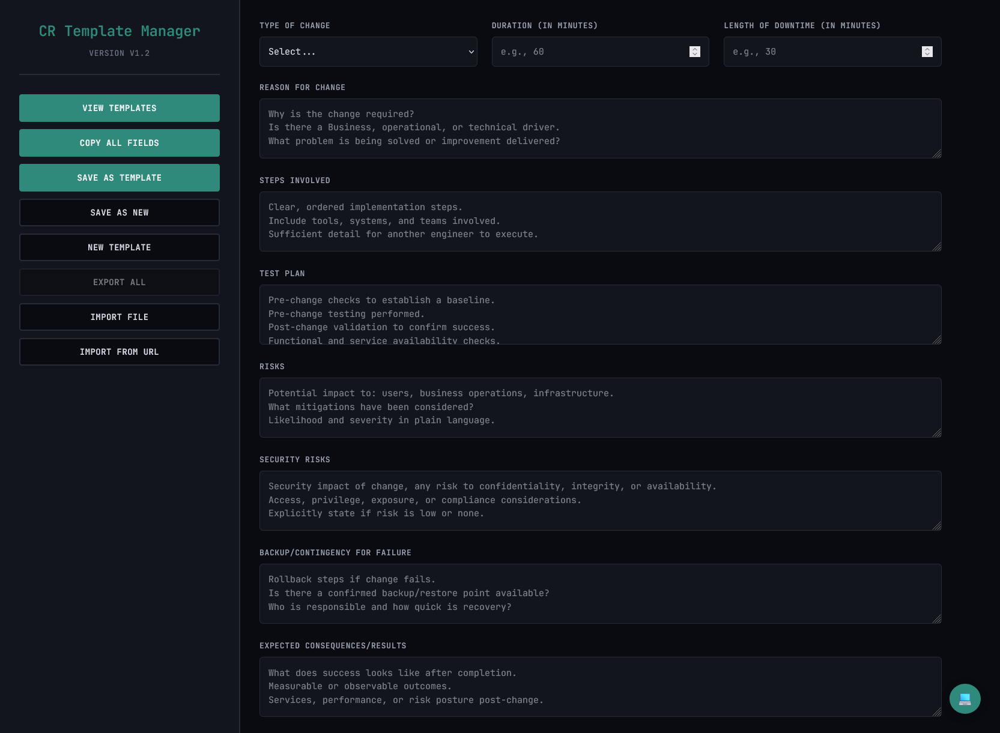

# Change Request Template Manager

A single-page, browser-based tool for building and reusing IT change request
templates (reason, steps, test plan, risks, security risks, backup plan,
expected results). No backend, no build step — open `index.html` and go.



## Features

- Create, edit and duplicate change request templates with fields for type of
  change, duration, downtime, reason, implementation steps, test plan, risks,
  security risks, backup plan and expected results.
- Copy a filled-out template straight to the clipboard, ready to paste into
  your change management system.
- Light, dark and terminal themes, remembered across visits.
- Import/export templates as JSON, individually or all at once.
- Import a shared template library from an HTTPS URL (see "Central template
  library" below).
- Ships with six ready-to-use example templates (application install, user
  offboarding, privileged account creation, basic user creation, firewall
  policy change, VM disk expansion) so there's something to try immediately.

## Running it

Just open `index.html` in a browser. Everything runs client-side and
templates are stored in `localStorage`, so nothing is uploaded anywhere
unless you explicitly import from a URL.

For hosting, any static file server works, e.g.:

```bash
python3 -m http.server 8080
# then open http://localhost:8080/
```

## Central template library

The app can pull a shared set of templates from a URL you provide (HTTPS
only — the import is rejected otherwise). `central-templates.json` in this
repo is an example library with the six bundled templates; host it yourself
(or a copy of it) somewhere HTTPS-reachable to share templates across a
team.

The "Import from URL" field is blank by default — paste in the URL of your
own hosted copy of `central-templates.json` (or any compatible template
file) to share templates across a team. A previous version of this repo
pre-filled the field with the author's own instance; that placeholder has
been removed so nobody imports templates from someone else's server by
accident.

## Dependencies

React, ReactDOM, Babel Standalone and DOMPurify are vendored in `js/` so the
app works fully offline. If a vendored file is missing or fails to load, each
`<script>` tag falls back to the equivalent CDN build automatically. All four
libraries are MIT (React, ReactDOM, Babel) or Apache-2.0/MPL-2.0 (DOMPurify)
licensed — see each project's own repository for full license text.

## Security notes

- Imported templates (file or URL) are schema-validated and sanitised with
  DOMPurify before use.
- URL import is restricted to `https://` only.
- No analytics, telemetry, or third-party calls beyond the optional template
  URL you choose to import from and the Google Fonts stylesheet.
